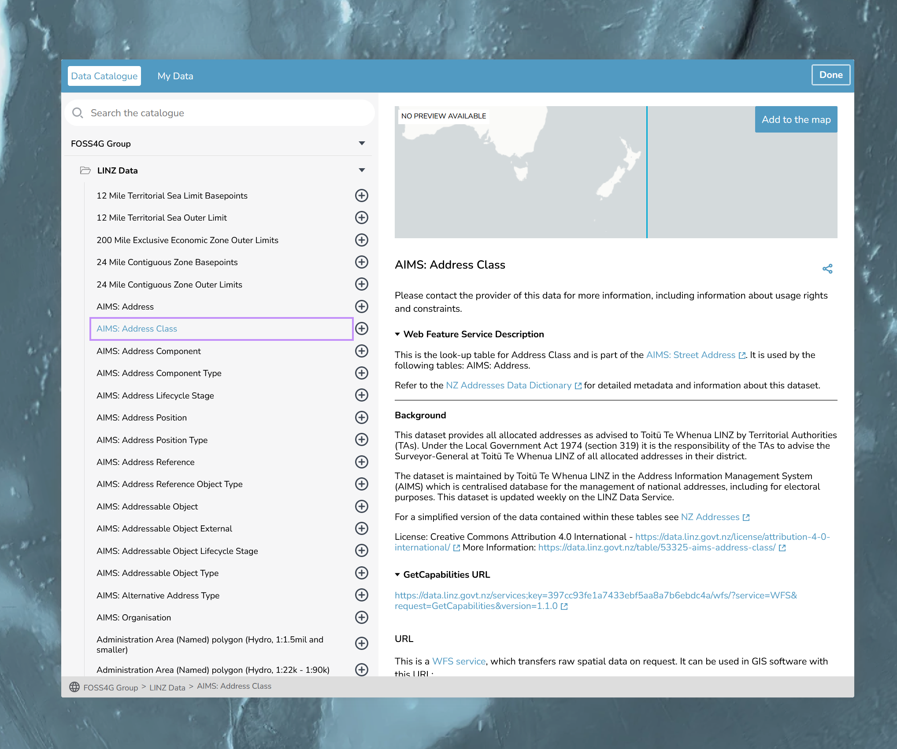

# Catalogs and Datasets

## Intro

Now that we have our map looking the way we want it to, we need to add some data to it! TerriaJS uses a catalog to store all of the data that is displayed on the map.  The catalog is defined in a JSON file, which is loaded by the application when it starts up.

By the end of this section of the workshop, you will have a better understanding of how catalogs and datasets work in TerriaJS. You will be able to create your own catalogs and add datasets to them. You will also be able to define the properties of each dataset, such as its name, description, and style.

***nb: A lot of the information in this guide is taken directly from [TerriaJS documentation](https://docs.terria.io/guide/connecting-to-data/) This is the best resource for learning about TerriaJS, and we recommend that you refer to it if you get stuck.***


### Cross-Origin Resource Sharing (CORS)

If you are trying to load data from a different domain than your TerriaJS application, you may run into issues with Cross-Origin Resource Sharing (CORS). TerriaJS provides a way to work around these issues using a proxy. For more information on how to set up a proxy, please refer to the [TerriaJS documentation on CORS](https://docs.terria.io/guide/connecting-to-data/cross-origin-resource-sharing/).

The image below shows the catalog for the NationalMap app.


## Catalogs

A catalog is a hierarchical tree structure that defines the datasets (catalog items) that are displayed on the map. Each node in the tree represents a catalog item or a group of catalog items. The catalog is defined in a JSON file, which is loaded by the application when it starts up.

In this workshop, we will be creating a catalog for our map. We will define the catalog items that we want to display on the map and group them together in a logical way.

## Catalog Items

A catalog item is a collection of data that can be displayed on the map. In TerriaJS, catalog items can be of different types, such as GeoJSON, WMS, or CSV. Each catalog item has a set of properties that define how it is displayed on the map.

Please refer to the docs for more information on [catalog items](https://docs.terria.io/guide/connecting-to-data/catalog-items).

In this workshop, we will be adding catalog items to our catalog. We will define the properties of each catalog item, such as its name, description, and style.


## Catalog basics

As mentioned the we configure the catalog in JSON.  JSON is a data format that is used to store and exchange data. It is a text-based format that is easy to read and write. It is also easy for computers to parse and generate.

Each catalog file:
- must be valid JSON
    - " not '
    - no comments
    - all keys must be quoted { "key": "value" }
    - case matters "esri-mapServer-group"

- top level items must be group types


### Lets get started


A very minimal example

https://gist.githubusercontent.com/sixlighthouses/6f3563aa9827eb671460215e99612876/raw/3439e495b60c849ee46a78faf2b6daf5744b1e2b/foss4g.json

```
    {
        "homeCamera": {
            "north": -34,
            "east": 178,
            "south": -49,
            "west": 166
        },
        "catalog": [
            {
            "id": "d1db650c-9372-4eec-8dec-33a0c04744ac",
            "name": "FOSS4G Group",
            "type": "group"
            }
        ],
        "viewerMode": "3dSmooth",
        "baseMaps": {
            "defaultBaseMapId": "basemap-positron",
            "previewBaseMapId": "basemap-positron"
        }
    }
```


If we want to use a public gist, we can use the raw url to load it into our TerriaMap by appending the url to the gist to the end of the url for our TerriaMap.  For example, if we wanted to load the above gist into our TerriaMap, we would use the following url:

```
http://localhost:3001/#clean&https://gist.githubusercontent.com/sixlighthouses/6f3563aa9827eb671460215e99612876/raw/3439e495b60c849ee46a78faf2b6daf5744b1e2b/foss4g.json
```


the folowing steps are needed to create your gist:

1. Go to the GitHub website and log in to your account.
2. Click on the "+" icon in the top right corner of the page and select "New gist".
3. In the "Gist description" field, enter a brief description of your gist.
4. In the "Filename including extension" field, enter a name for your file. Make sure to use the .json extension.
5. In the "Add file" section, enter the content of your file.
6. Add in your TerriaMap config file.
7. Once you have added all the files you want, select the "Public" option if you want your gist to be visible to everyone, or select "Secret" if you want it to be private.
8. Click on the "Create secret gist" or "Create public gist" button, depending on your choice.

That's it! Your gist is now created and you can share the URL with others.

### Add a basemap

We can configure the basemap in the catalog. The gist below makes use of the [LINZ Ariel Imagery basemap](https://linz.maps.arcgis.com/home/item.html?id=850d6096d89b48228a0638842fa3801c).

```
https://gist.githubusercontent.com/sixlighthouses/f5e7be45840d2a57746a0b746d96ef6a/raw/59de5d0f91aafeb7cd2fbef968bc985022b8a0ce/foss4g_1.json
```

### Add a WebFeatureServiceGroup

Add the LINZ WFS group to the catalog, as a member of our group

https://gist.githubusercontent.com/sixlighthouses/8b15850cc82177764f72b558b351d11d/raw/22068f80ec890c319b27755d6fe376ed06c113f4/foss4g_2.json

```
 {
    "id": "d1db650c-9372-4eec-8dec-33a0c04744ac",
    "name": "FOSS4G Group",
    "type": "group",
    "members": [
        {
        "id": "79f3b210-ad14-4b82-8848-beb7fc1fdc2c",
        "type": "wfs-group",
        "name": "LINZ Data",
        "url": "https://data.linz.govt.nz/services;key=397cc93fe1a7433ebf5aa8a7b6ebdc4a/wfs/?service=WFS&request=GetCapabilities"
        }
    ]
}
```



