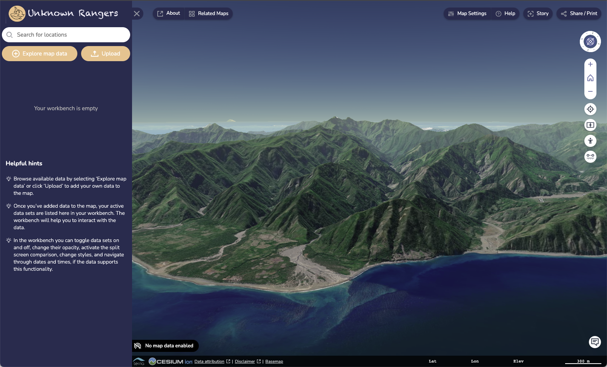

# Theming Your Terria Map!

Once you have your local development environment set up, the next step is to modify the look and feel of the map to suit you!

TIPS: Think of a good specific use case for your map. Mine is for the 'Unknown Rangers', a ranger group working on managing the natural and cultural values of a remote area. Note here, that I have customised the colour scheme and have a title and logo. The starting view of the map is also customised to be over an area of impressive terrain, and the map is set to initialise in 3D mode.

So lets try and do this ourselves!

