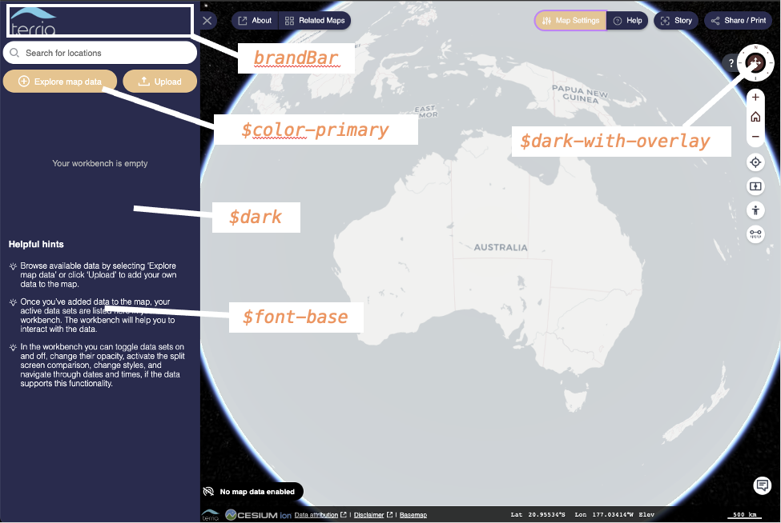
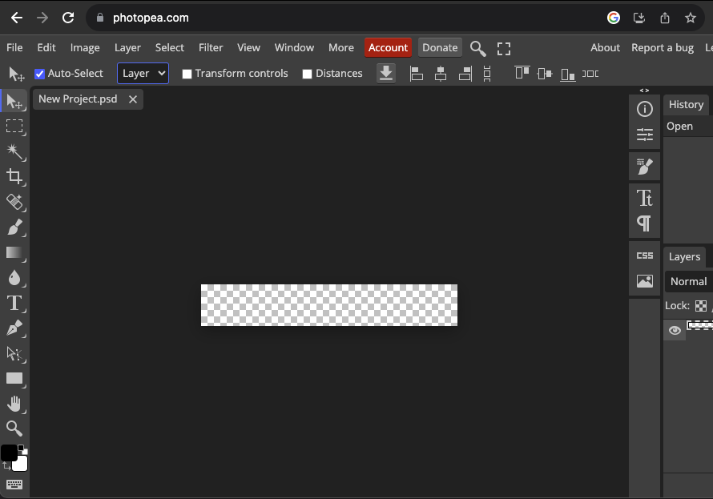

# Theming Your Terria Map!

This is the SASS based version - this will only work for "running and building" TerriaMap

Also see

- [Theming (JSON based) - this will work for both pre-built and "running and building" TerriaMap](https://github.com/TerriaJS/workshops/blob/main/foss4g-auckland-2023/build-your-own-terriamap/theming-json-based.md)

## Intro
Once you have your local development environment set up, the next step is to modify the look and feel of the map to suit you!

***TIPS: Think of a good specific use case for your map.*** Mine is for the 'Unknown Rangers', a ranger group working on managing the natural and cultural values of a remote area. Note here, that I have customised the colour scheme and have a title and a cool logo of a shark. The starting view of the map is also customised to be over an area of impressive terrain, and the map is set to initialise in 3D mode:


So lets try and do this ourselves! TerriaJS can be extensively customized, often without writing any code. The catalog and many aspects of the look and feel are controlled by JSON configuration files.

To do this we are going to be editing files in both the `TerriaMap` and the `terriajs` repos. So make sure you have your development environment set up, and have `yarn gulp watch` running so that we can see our changes live. See [the local setup guide](foss4g-auckland-2023/build-your-own-terriamap/run-locally.md) for details!

We also have docs for this, take a look if you get stuck, [here](https://docs.terria.io/guide/customizing/)


## Step 1: Edit the Colours

We want to change some of the elements to make it our own:

Here is the code in the relevant file:

`lib/Styles/variables.scss`

```scss
// To customise the look of your map, uncomment and change values here and in lib/Views/global.scss


// If your logo is big, set this to give it more room.
//$logo-height: 120px;

// If using a non-standard font, remember to include an @import statement in global.scss
$font-base: 'Josefin Sans', sans-serif;
$font-pop: $font-base; // If you just want to use one font throughout, do this.

// These variables are for buttons and text.
// "color-secondary" should be a lighter color than "color-primary" but still readable contrasted with white.
$color-primary: rgb(241,199,151);
$color-secondary: hsl(60,80%,60%); // or: lighten($color-primary, 20%);

// These variables set background panel colors
$dark: rgb(40,52,88);
$dark-with-overlay: hsl(0,30%,30%);
$dark-lighter: hsl(0,30%,50%);

// You might find it helpful to define these and use them.
$color-primary-light:lighten($color-primary,10%);
$color-primary-dark:darken($color-primary,10%);
$dark-darker: hsl(0,30%,15%);
```

And here is a hint to the elements that they modify:




Save your changes and then refresh your browser at http://localhost:3001/

## Step 2: Change the Branding Bar

At the top left of the screen is the Branding Bar. This is defined as an html string in the `config.json` file of `TerriaMap`.

[Here is the parameter that we will modify](https://github.com/TerriaJS/TerriaMap/blob/14bf848b651a8403401f3c7a39f6a4075a0654c7/wwwroot/config.json#L47)

But first, we need to generate a logo.
You can do this with any image editor, [GIMP](https://www.gimp.org/downloads/) on your desktop, or https://www.photopea.com/ online if you dont want to install software:




- Make a new canvas 320px by 52px.
- Add some text and an image.
- I prefer to make a transparent PNG with white text...
- Then save the image to your copy of the TerriaMap repo at `TerriaMap/wwwroot/images/branding-bar.png`

Now modify the code for
["brandBarElements"here](https://github.com/TerriaJS/TerriaMap/blob/14bf848b651a8403401f3c7a39f6a4075a0654c7/wwwroot/config.json#L47) to point to your image at `image/branding-bar.png`.


## Step 3: Other Tidy Up

Some more properties in `config.json` you may want to change:
```
["parameters"]["appName"]
["parameters"]["supportEmail"]
["parameters"]["languageConfiguration"]["languages"]
["initializationUrls"]
```
