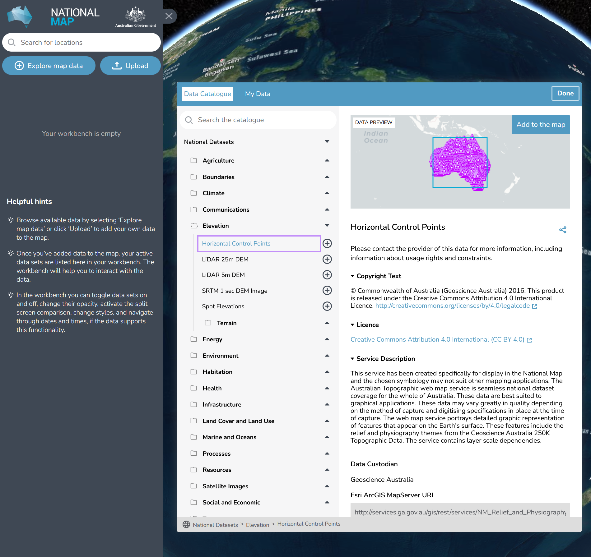
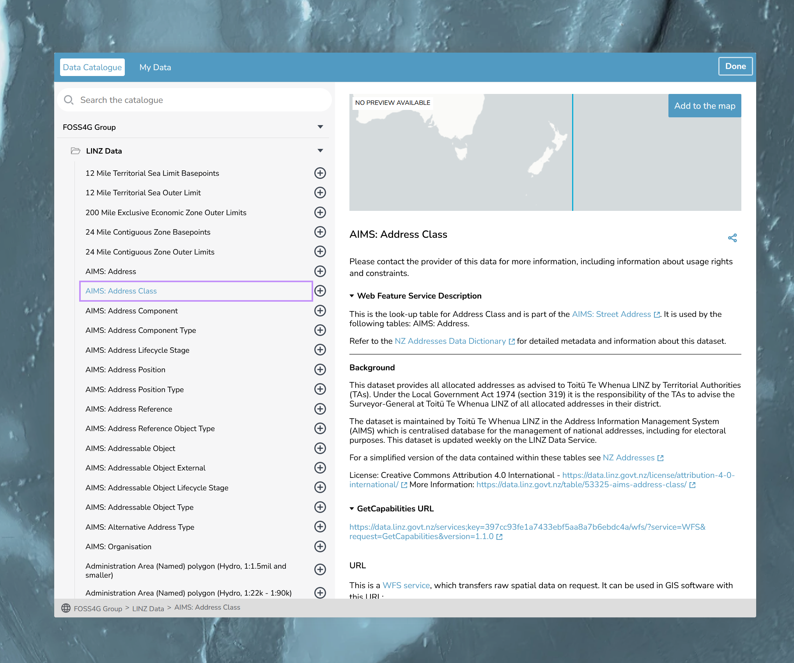

# Catalogs and Datasets

## Intro

TerriaJS uses a catalog to store all of the data that is displayed on the map. The catalog is defined in a JSON file, which is loaded by the application when it starts up.

By the end of this section of the workshop, you will have a better understanding of how catalogs and datasets work in TerriaJS. You will be able to create your own catalogs and add datasets to them. You will also be able to define the properties of each dataset, such as its name, description, and style.

**_nb: A lot of the information in this guide is taken directly from [TerriaJS documentation](https://docs.terria.io/guide/connecting-to-data/) This is the best resource for learning about TerriaJS, and we recommend that you refer to it if you get stuck._**

TerriaJS has around 1000 different configuration properties, so it can get complicated. We recommend starting with simple data sources (like Web Map Service and GeoJSON) instead of data sources that require extensive configuration (like CKAN and CSW).

There are list of examples for different data types in the [TerriaJS documentation](https://docs.terria.io/guide/connecting-to-data/#getting-started)

The image below shows the catalog for the NationalMap app.



### Cross-Origin Resource Sharing (CORS)

If you are trying to load data from a different domain than your TerriaJS application, you may run into issues with Cross-Origin Resource Sharing (CORS). TerriaJS provides a way to work around these issues using a proxy. For more information on how to set up a proxy, please refer to the [TerriaJS documentation on CORS](https://docs.terria.io/guide/connecting-to-data/cross-origin-resource-sharing/).

**Note** if you are using the "pre-built" TerriaMap, you are unable to use the TerriaJS proxy. You will need to setup the full developer environment.

## Catalogs

A catalog is a hierarchical tree structure that defines the datasets (catalog items) that are displayed on the map. Each node in the tree represents a catalog item or a group of catalog items. The catalog is defined in a JSON file, which is loaded by the application when it starts up.

In this workshop, we will be creating a catalog for our map. We will define the catalog items that we want to display on the map and group them together in a logical way.

## Catalog Items

A catalog item is a collection of data that can be displayed on the map. In TerriaJS, catalog items can be of different types, such as GeoJSON, WMS, or CSV. Each catalog item has a set of properties that define how it is displayed on the map.

Please refer to the docs for more information on [catalog items](https://docs.terria.io/guide/connecting-to-data/catalog-items).

In this workshop, we will be adding catalog items to our catalog. We will define the properties of each catalog item, such as its name, description, and style.

## Catalog basics

As mentioned the we configure the catalog in JSON. JSON is a data format that is used to store and exchange data. It is a text-based format that is easy to read and write. It is also easy for computers to parse and generate.

Each catalog file:

- must be valid JSON

  - `"` not `'`
  - no comments
  - all keys must be quoted `{ "key": "value" }`
  - case matters `"esri-mapServer-group"`

- top level items must be group types

### Lets get started

A very minimal example

```json
{
  "homeCamera": {
    "north": -34,
    "east": 178,
    "south": -49,
    "west": 166
  },
  "catalog": [
    {
      "name": "FOSS4G Group",
      "type": "group"
    }
  ],
  "viewerMode": "3dSmooth",
  "baseMaps": {
    "defaultBaseMapId": "basemap-positron",
    "previewBaseMapId": "basemap-positron"
  }
}
```

Your catalog can be found in `init/foss4g.json`. You can edit this and then reload the page to see changes.

### Add a basemap

We can configure the basemap in the catalog. The gist below makes use of the [LINZ Ariel Imagery basemap](https://linz.maps.arcgis.com/home/item.html?id=850d6096d89b48228a0638842fa3801c).

```
https://gist.githubusercontent.com/sixlighthouses/f5e7be45840d2a57746a0b746d96ef6a/raw/59de5d0f91aafeb7cd2fbef968bc985022b8a0ce/foss4g_1.json
```

```json
PUT JSON HERE
```

### Add a WebFeatureServiceGroup

Add the LINZ WFS group to the catalog, as a member of our group

```json
{
  "id": "d1db650c-9372-4eec-8dec-33a0c04744ac",
  "name": "FOSS4G Group",
  "type": "group",
  "members": [
    {
      "id": "79f3b210-ad14-4b82-8848-beb7fc1fdc2c",
      "type": "wfs-group",
      "name": "LINZ Data",
      "url": "https://data.linz.govt.nz/services;key=397cc93fe1a7433ebf5aa8a7b6ebdc4a/wfs/?service=WFS&request=GetCapabilities"
    }
  ]
}
```



#### Add a layer from a WMS

Single layer : water
https://gist.githubusercontent.com/sixlighthouses/90a87c873c613938714481047e00159c/raw/8fb31d7e3aba625c396d4f5de3e2f1ed0e24b6d5/foss4g_3.json

```json
PUT JSON HERE
```

Two layers : water and slope class
https://gist.githubusercontent.com/sixlighthouses/90a87c873c613938714481047e00159c/raw/4eff5b4063d5f66c6003ccaf04db0ad1e28b5a0d/foss4g_3.json

```json
PUT JSON HERE
```

### Let's add some of your data

Do you have access to some data your wish to load. Check the documentation and get some help from the Terria team and let's add it to your map.

You can get started with different data types [here](https://docs.terria.io/guide/connecting-to-data/)

If you see an interesting dataset on one of our Maps - like NationalMap - let us know and we can share the TerriaJS configuration!

### Advanced options

TerriaJS catalogs have many other configuration options. You can find them in the [TerriaJS Init Source Documentation](...asdfasdf)
