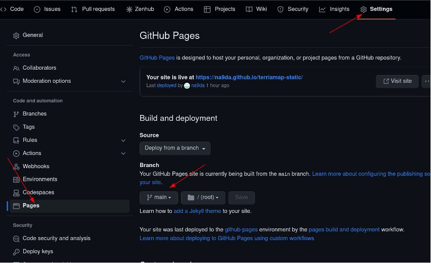
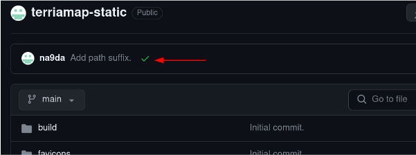

# Deploying to GitHub pages

The https://github.com/TerriaJS/terriamap-static repository is a static JavaScript Web Application. This means it can be hosted by any basic HTTP web server.

GitHub pages provides a **free** and easy way to publish websites that are **publicly accessible**.

## Clone or Fork `terriamap-static`

If you have cloned the https://github.com/TerriaJS/terriamap-static repository, create a new GitHub repository on your own account, and follow the instructions to push code

Alternatively, you can "fork" our repository to your account!

## Change `index.html` base URL

When you publish on GitHub pages, the URL will follow the pattern:

- `https://USERNAME.github.io/REPOSITORY_NAME/`

This changes the root path of the website - which is usually hosted at `/` not `/REPOSITORY_NAME/`.

We can fix this by changing the `<base href="...">` tag in the `index.html` file:

```html
<!DOCTYPE html>
<html lang="en" class="terria">
  <head>
    <base href="/REPOSITORY_NAME/" />
    ...
  </head>
</html>
```

## Enable GitHub Pages

- Repository settings
- Click "Pages" in the sidebar
- Enable on `main` branch



### Wait for build to succeed

- Go back to the repository "Code" page
- Wait for green tick (you may need to refresh)



### Go you your published TerriaMap!

- There will be a link in the "Pages" settings page
- Or you can follow this format
  - `https://USERNAME.github.io/REPOSITORY_NAME/`

## Edit Config

Now that you have a live map, you can edit your TerriaJS config without downloading any files!

Navigate to the `config.json` file or `init/foss4g.json` catalog file, and click "Edit".

**Note** when you save (commit) changes, it may take a few minutes to see them in your published GitHub pages website


